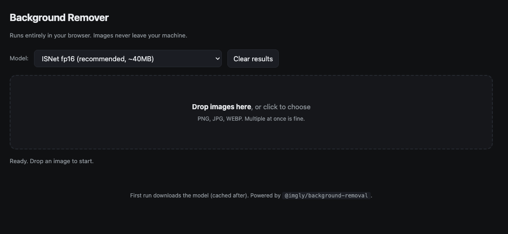

# Background Remover

A single-page web app that removes backgrounds from images and exports transparent PNGs. Everything runs in your browser. Images never leave your machine.

**Live demo:** https://ianpilon.github.io/background-remover/



## Features

- 100% client-side. No upload, no server, no API key.
- Drag and drop one image or many.
- Three model options (speed vs. quality tradeoff).
- Side-by-side preview of original vs. transparent result.
- One-click PNG download per image.
- Works offline after the first run (model cached by the browser).

## Usage

1. Open https://ianpilon.github.io/background-remover/
2. Drop one or more images on the drop zone, or click to choose.
3. Wait for the model to load on first run (about 40 MB, cached after).
4. Click **Download** on each result to save the transparent PNG.

### Model picker

| Model | Size | Speed | Quality |
|-------|------|-------|---------|
| ISNet fp16 (default) | ~40 MB | Fast | High |
| ISNet full precision | ~80 MB | Slow | Highest (best for hair and fine edges) |
| ISNet quint8 | ~20 MB | Fastest | Good (best for bulk work) |

## How it works

The app loads [`@imgly/background-removal`](https://github.com/imgly/background-removal-js) from a CDN. The library runs an ISNet segmentation model in the browser via ONNX Runtime Web (WebAssembly). The model produces an alpha mask, the app composites the original image against transparency, and the result is exported as a PNG.

## Run locally

No build step. Either:

```bash
# Option A: just open the file in a browser
open index.html

# Option B: serve it (avoids any future CORS edge case)
python3 -m http.server 8000
# then visit http://localhost:8000
```

## Tech stack

- Vanilla HTML, CSS, and ES modules. No framework, no bundler.
- [`@imgly/background-removal`](https://github.com/imgly/background-removal-js) for inference.
- ONNX Runtime Web for the model runtime.
- Hosted on GitHub Pages.

## Privacy

Nothing leaves your browser. The only network requests are to fetch the library and model files from a CDN on first visit. After that, everything (image processing, the model, the UI) runs locally.
